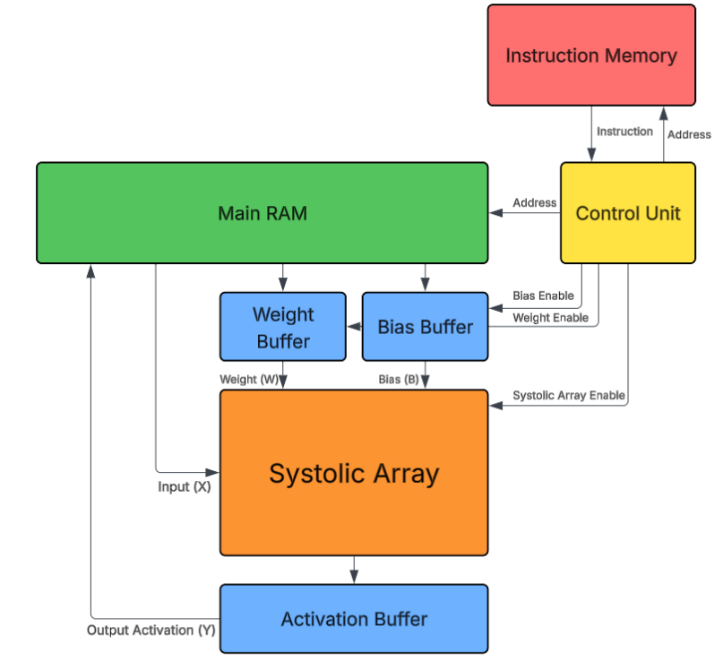

# NPU-Core
## Aims
Continuing the Systolic Array Project by building on chip, dedicated memory buffers and a programmable control unit. The end goal is to synthesize the design onto an FPGA and interface it with a host computer over a serial interface to execute matrix operations

## Introduction

Above is a block diagram draft of the NPU Core design (it is still a work in progress so some things may change). The design features separated memory for instructions and data as well as buffers for Weights, Biases and Activations (outputs of the systolic array). There will be additional components such as a Serial Transmitter for communication with the host device or a DMA controller to allow for data transmitted from the host to be directly written to the main memory but these will be implemented later after the basic infrastructure is created.

## Current Progress
- Instruction Memory and Control Unit modules have been created and tested in ModelSim.
- Control Unit features a simple instruction set, currently supporting 8 bit instructions (3 bit opcode, 5 bit operand) and recognizing 4 instructions:
  - LDW (Load Weight, 001): Loads weights into weight buffer from main memory. The operand dictates the starting address of the weights in memory.
  - LDB (Load Bias, 010): Loads biases into bias buffer from main memory. The operand dictates the starting address of the biases in memory.
  - EX (Execute with Inputs, 011): Stream inputs to systolic array to start calculation. The operand determines how many consecutive inputs are to be queued to be processed.
  - HALT (Halt, 100): Halts entire NPU Core. Currently, requires a Reset to exit halted state.
- Modified systolic array to include internal delay registers to eliminate external timing logic. Control unit can stream inputs directly from RAM as a clean vector of numbers and the array handles the timing.
